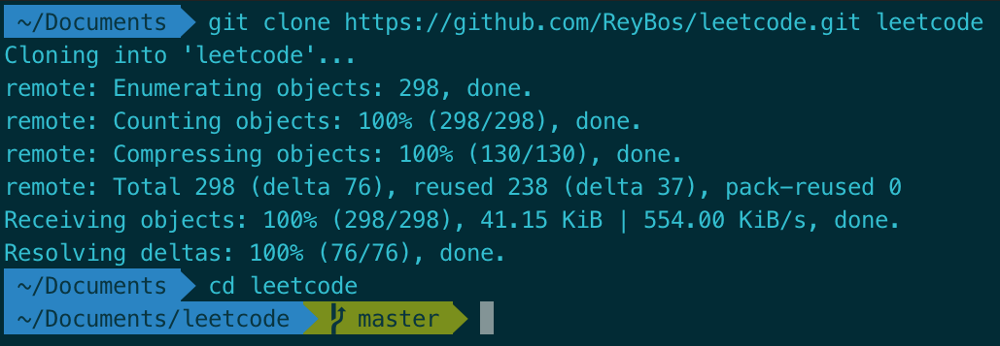
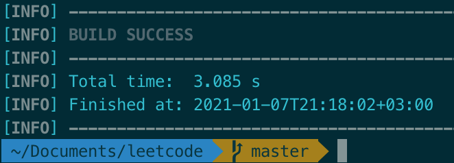
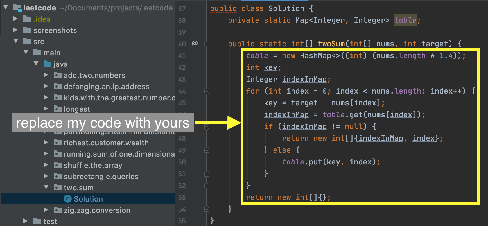
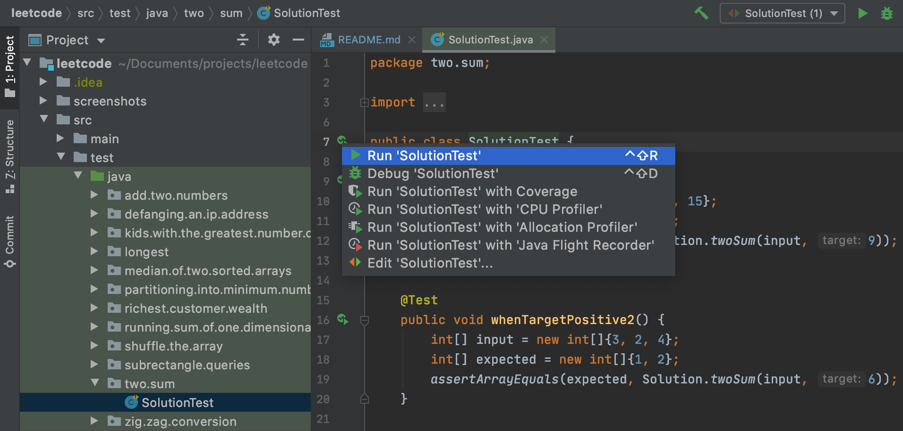
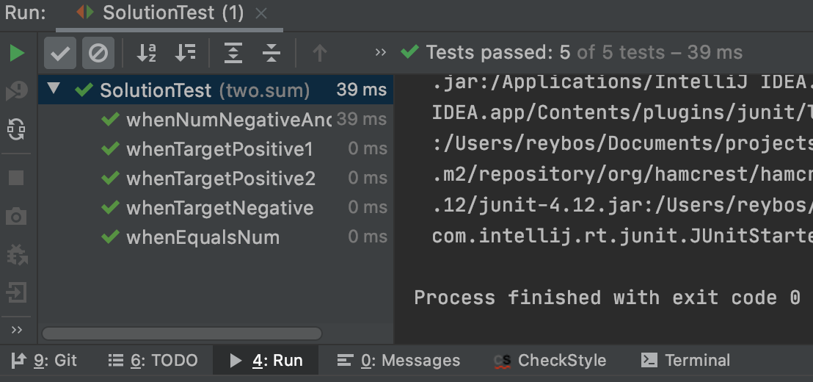
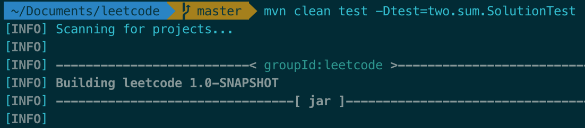
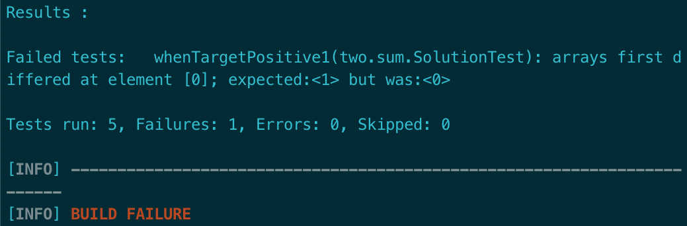

# LeetCode

    My profile on <a href="https://leetcode.com/ReyBos/">leetcode</a>

<h3>Used technologies:</h3>
<ul>
  <li>Open JDK 14 - compiler \ interpreter</li>
  <li>Maven - project management</li>
  <li>JUnit4 - testing</li>
</ul>
<h3>Project structure:</h3>
<pre>
<code>.
└ src
   ├─ main
   └─ test</code>
</pre>
<!--
 ├── main
 |   ├── index.js
 |   ├── product.js
 |   └── product.test.js
 └── test
 |   ├── index.js
 |   ├── user.js
 |   └── user.test.js</code>
 -->

    All tasks are in the "./src/main/java" folder, and tests are in the "./src/test/java" folder

    Each leetcode task is in its own package. The package name depends on the job name, for example, the "richest.customer.wealth" package is used for the "Richest Customer Wealth" job

    For convenience, links to solutions and tests are collected in the table below

<h3>How to install:</h3>

    First, you must have installed <a href="https://maven.apache.org/">Maven</a>

    Then you need to open a terminal in the folder where you are going to store the project. 
    Now we download files from the remote repository

<pre>
<code>$ git clone https://github.com/ReyBos/leetcode.git leetcode</code>
</pre>

    "https://github.com/ReyBos/leetcode.git" - repository address, if you forked this repository yourself, then the address will be different 
    "leetcode" - the name of the target folder

    

    After successfully loading the data, you need to go to the project folder and collect it.

<pre>
<code>$ cd leetcode
$ mvn install</code>
</pre>

    

    This completes the installation of the project, you can proceed to use.

<h3>How to use:</h3>

For every problem I solved, junit4 tests were written, you can use them to test your solutions. To do this, you need to find the task you are interested in in the table below and see in which package it lies. Or see the principle of forming a package for a task in the "Project structure" section. For example, the solution for a task named "Two sum" will be located at "src/main/java/two/sum/Solution.java" 
After you find the file you want, replace my code in it with yours.

    

    Now you can run the tests, the algorithm may differ depending on which tool you use. 
I will consider two options: running tests in terminal and in IntelliJ IDEA

<h4>IntelliJ IDEA</h4>

Find a test with the same package as the solution and run it

    

    As a result, you will receive either a message about the successful passing of the tests, or information about the failed tests

    

<h4>Terminal</h4>

    To test through the terminal, you need to go to the project folder and execute the command to run the test

<pre>
<code>$ cd leetcode
$ mvn clean test -Dtest=your.package.TestClassName</code>
</pre>

Let's see what your.package.TestClassName is using the example of the "Two sum" task. 
The name of the package for this task will be "two.sum", so the test will be located at the address "src/test/java/two/sum", where we will find the name of the class for the test "SolutionTest". Then "your.package.TestClassName" for this task will be "two.sum.SolutionTest". 
Let's run this test.

    

    If all tests are passed, we will receive a "BUILD SUCCESS" message, otherwise an error message and failed tests.

    

<h3>So far resolved issues:</h3>
<table>
  <thead>
    <tr>
      <th align=center>
        #
      </th>
      <th align=center>
        Title
      </th>
      <th align=center>
        Solution
      </th>
      <th align=center>
        Difficulty
      </th>
      <th align=center>
        Runtime   faster than
      </th>
      <th align=center>
        Memory Usage   less than
      </th>
    </tr>
  </thead>
  <tbody>
    <tr>
        <td align=center>
          <a href="https://leetcode.com/problems/richest-customer-wealth/">1672</a>
        </td>
        <td>
          Richest Customer Wealth
        </td>
        <td align=center>
          <a href="https://github.com/ReyBos/leetcode/tree/master/src/main/java/running/richest/customer/wealth">java</a>  
          <a href="https://github.com/ReyBos/leetcode/tree/master/src/test/java/running/richest/customer/wealth">tests</a>
        </td>
        <td align=center>
          Easy
        </td>
        <td align=center>
          0 ms   100.00%
        </td>
        <td align=center>
          38.6 MB   61.35%
        </td>
    </tr>
    <tr>
        <td align=center>
          <a href="https://leetcode.com/problems/partitioning-into-minimum-number-of-deci-binary-numbers/">1689</a>
        </td>
        <td>
          Partitioning Into Minimum Number Of Deci-Binary Numbers
        </td>
        <td align=center>
          <a href="https://github.com/ReyBos/leetcode/tree/master/src/main/java/partitioning/into/minimum/number/of/deci/binary/numbers">java</a>  
          <a href="https://github.com/ReyBos/leetcode/tree/master/src/test/java/partitioning/into/minimum/number/of/deci/binary/numbers">tests</a>
        </td>
        <td align=center>
          Medium
        </td>
        <td align=center>
          4 ms   96.41%
        </td>
        <td align=center>
          39.9 MB   51.56%
        </td>
    </tr>
    <tr>
        <td align=center>
          <a href="https://leetcode.com/problems/running-sum-of-1d-array/">1480</a>
        </td>
        <td>
          Running Sum of 1d Array
        </td>
        <td align=center>
          <a href="https://github.com/ReyBos/leetcode/tree/master/src/main/java/running/sum/of/one/dimensional/array">java</a>  
          <a href="https://github.com/ReyBos/leetcode/tree/master/src/test/java/running/sum/of/one/dimensional/array">tests</a>
        </td>
        <td align=center>
          Easy
        </td>
        <td align=center>
          0 ms   100.00%
        </td>
        <td align=center>
          39.1 MB   72.55%
        </td>
    </tr>
    <tr>
        <td align=center>
          <a href="https://leetcode.com/problems/subrectangle-queries/">1476</a>
        </td>
        <td>
          Subrectangle Queries
        </td>
        <td align=center>
          <a href="https://github.com/ReyBos/leetcode/tree/master/src/main/java/subrectangle/queries">java</a>  
          <a href="https://github.com/ReyBos/leetcode/tree/master/src/test/java/subrectangle/queries">tests</a>
        </td>
        <td align=center>
          Medium
        </td>
        <td align=center>
          25 ms   54.30%
        </td>
        <td align=center>
          42.8 MB   70.32%
        </td>
    </tr>
    <tr>
        <td align=center>
          <a href="https://leetcode.com/problems/shuffle-the-array/">1470</a>
        </td>
        <td>
          Shuffle the Array
        </td>
        <td align=center>
          <a href="https://github.com/ReyBos/leetcode/tree/master/src/main/java/shuffle/the/array">java</a>  
          <a href="https://github.com/ReyBos/leetcode/tree/master/src/test/java/shuffle/the/array">tests</a>
        </td>
        <td align=center>
          Easy
        </td>
        <td align=center>
          0 ms   100.00%
        </td>
        <td align=center>
          39.1 MB   75.92%
        </td>
    </tr>
    <tr>
        <td align=center>
          <a href="https://leetcode.com/problems/kids-with-the-greatest-number-of-candies">1431</a>
        </td>
        <td>
          Kids With the Greatest Number of Candies
        </td>
        <td align=center>
          <a href="https://github.com/ReyBos/leetcode/tree/master/src/main/java/kids/with/the/greatest/number/of/candies">java</a>  
          <a href="https://github.com/ReyBos/leetcode/tree/master/src/test/java/kids/with/the/greatest/number/of/candies">tests</a>
        </td>
        <td align=center>
          Easy
        </td>
        <td align=center>
          0 ms   100.00%
        </td>
        <td align=center>
          39.3 MB   33.00%
        </td>
    </tr>
    <tr>
        <td align=center>
          <a href="https://leetcode.com/problems/defanging-an-ip-address">1108</a>
        </td>
        <td>
          Defanging an IP Address
        </td>
        <td align=center>
          <a href="https://github.com/ReyBos/leetcode/tree/master/src/main/java/defanging/an/ip/address">java</a>  
          <a href="https://github.com/ReyBos/leetcode/tree/master/src/test/java/defanging/an/ip/address">tests</a>
        </td>
        <td align=center>
          Easy
        </td>
        <td align=center>
          0 ms   100.00%
        </td>
        <td align=center>
          36.9 MB   78.00%
        </td>
    </tr>
    <tr>
      <td align=center>
        <a href="https://leetcode.com/problems/zigzag-conversion/solution/">0006</a>
      </td>
      <td>
        ZigZag Conversion
      </td>
      <td align=center>
        <a href="https://github.com/ReyBos/leetcode/tree/master/src/main/java/zig/zag/conversion">java</a>  
        <a href="https://github.com/ReyBos/leetcode/tree/master/src/test/java/zig/zag/conversion">tests</a>
      </td>
      <td align=center>
        Medium
      </td>
      <td align=center>
        5 ms   73.00%
      </td>
      <td align=center>
        39.7 MB   50.41%
      </td>
    </tr>
    <tr>
      <td align=center>
        <a href="https://leetcode.com/problems/longest-palindromic-substring/">0005</a>
      </td>
      <td>
        Longest Palindromic Substring
      </td>
      <td align=center>
        <a href="https://github.com/ReyBos/leetcode/tree/master/src/main/java/longest/palindromic/substring">java</a>  
        <a href="https://github.com/ReyBos/leetcode/tree/master/src/test/java/longest/palindromic/substring">tests</a>
      </td>
      <td align=center>
        Medium
      </td>
      <td align=center>
        101 ms   40.26%
      </td>
      <td align=center>
        39.5 MB   46.51%
      </td>
    </tr>
    <tr>
      <td align=center>
        <a href="https://leetcode.com/problems/median-of-two-sorted-arrays/">0004</a>
      </td>
      <td>
        Median of Two Sorted Arrays
      </td>
      <td align=center>
        <a href="https://github.com/ReyBos/leetcode/tree/master/src/main/java/median/of/two/sorted/arrays">java</a>  
        <a href="https://github.com/ReyBos/leetcode/tree/master/src/test/java/median/of/two/sorted/arrays">tests</a>
      </td>
      <td align=center>
        Hard
      </td>
      <td align=center>
        2 ms   99.67%
      </td>
      <td align=center>
        39.9 MB   90.79%
      </td>
    </tr>
    <tr>
      <td align=center>
        <a href="https://leetcode.com/problems/longest-substring-without-repeating-characters/">0003</a>
      </td>
      <td>
        Longest Substring Without Repeating Characters
      </td>
      <td align=center>
        <a href="https://github.com/ReyBos/leetcode/tree/master/src/main/java/longest/substring/without/repeating/characters">java</a>  
        <a href="https://github.com/ReyBos/leetcode/tree/master/src/test/java/longest/substring/without/repeating/characters">tests</a>
      </td>
      <td align=center>
        Medium
      </td>
      <td align=center>
        6 ms   64.75%
      </td>
      <td align=center>
        39.3 MB   42.28%
      </td>
    </tr>
    <tr>
      <td align=center>
        <a href="https://leetcode.com/problems/add-two-numbers/">0002</a>
      </td>
      <td>
        Add Two Numbers
      </td>
      <td align=center>
        <a href="https://github.com/ReyBos/leetcode/tree/master/src/main/java/add/two/numbers">java</a>   
        <a href="https://github.com/ReyBos/leetcode/tree/master/src/test/java/add/two/numbers">tests</a>
      </td>
      <td align=center>
        Medium
      </td>
      <td align=center>
        2 ms   77.18%
      </td>
      <td align=center>
        39.4 MB   47.13%
      </td>
    </tr>
    <tr>
      <td align=center>
        <a href="https://leetcode.com/problems/two-sum/">0001</a>
      </td>
      <td>
        Two Sum
      </td>
      <td align=center>
        <a href="https://github.com/ReyBos/leetcode/blob/master/src/main/java/two/sum">java</a>  
        <a href="https://github.com/ReyBos/leetcode/blob/master/src/test/java/two/sum">tests</a>
      </td>
      <td align=center>
        Easy
      </td>
      <td align=center>
        0 ms   100.00%
      </td>
      <td align=center>
        39.2 MB   55.89%
      </td>
    </tr>
  </tbody>
</table>